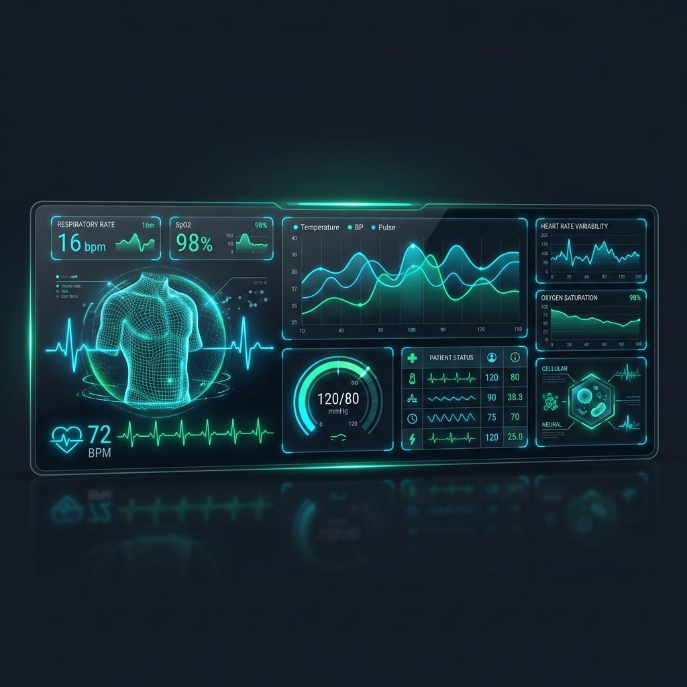

# 🩺 AegisHealth — Futuristic AI-Powered Healthcare Portal



An interactive, visually premium, and responsive virtual clinical workspace designed for next-generation personalized patient care. AegisHealth combines high-fidelity telemetry visualizers, automated medical calculations, emergency dispatch tools, and an AI diagnostic assistant into a unified dark-themed dashboard.

---

## 🚀 Key Features

### 1. 📊 Vitals Telemetry Console
*   **Live Metrics Grid**: High-fidelity tracking of Heart Rate (BPM), Blood Pressure (mmHg), Oxygen Level (SpO2), Body Temperature (°F), and Blood Glucose (mg/dL).
*   **Real-time SVG Waveforms**: Ambient SVG-drawn pulse lines that animate to show cardiac and diagnostic stability.
*   **Family Profile Switcher**: Instantly switch telemetry views between different family members with pre-populated records:
    *   **Shivam (Self)**: 19 Yrs, B+, mild cardiovascular palpitations.
    *   **Rajesh Sharma (Father)**: 52 Yrs, O+, hypertension, diabetes.
    *   **Priya Sharma (Sister)**: 14 Yrs, B+, exercise-induced asthma.

### 2. 🚨 Critical Care Emergency SOS
*   **Immediate Dispatch**: Interactive, pulsing SOS overlay that initiates a 5-second cancelable dispatch sequence.
*   **Smart Telemetry Sharing**: Automatically broadcasts active vitals, blood type, allergies, and mock coordinates (`47.6062° N, 122.3321° W`) to paramedics.
*   **Audit Logging**: Outputs system alerts and telemetry states directly to the patient console.

### 3. 🤖 AI Clinical Assistant
*   **Symptom Assessment**: Simulated chat companion for immediate clinical questions.
*   **Custom Prompting**: Type in symptoms (e.g., "chest pain", "shortness of breath") to receive AI-suggested guidance, risk assessment, and doctor recommendations.

### 4. ⚡ Daily Tracking & Calculators
*   **Target Activity Rings**: Custom SVG circular gauges tracking Steps (78% target), Sleep hours, and Calorie expenditures.
*   **Water Intake Tracker**: Interactive logger with progress animation (+250ml / +500ml).
*   **AI BMI Calculator**: Compute Body Mass Index on-the-fly and receive real-time classification (Underweight, Normal, Overweight, Obese).

---

## 🛠️ Technology Stack

AegisHealth is designed to be lightweight, performant, and dependency-free for local compilation:
*   **Core**: HTML5, Vanilla JavaScript (ES6+ Modules)
*   **Styling**: Tailwind CSS (via CDN) paired with custom Vanilla CSS for glassmorphism effects and glow rings
*   **Animation**: GSAP (GreenSock Animation Platform) for loading sequences and entrance animations
*   **Smooth Scroll**: Lenis Scroll integration for buttery smooth page navigation
*   **Icons**: FontAwesome v6.4.0

---

## 📁 Repository Structure

```
aegishealth-futuristic-portal/
├── index.html         # Homepage, vitals dashboard, search & services preview
├── dashboard.html     # Patient console dashboard (SOS, AI doctor, vitals details)
├── banner.png         # Project banner image
├── css/
│   └── style.css      # Core styles, glassmorphism, keyframes, scrollbars
└── js/
    ├── app.js         # Core homepage logic and interactive widgets
    ├── dashboard.js   # Telemetry, SOS state, vitals renderer, AI Assistant
    ├── mockData.js    # Local datastore for family members, vitals, prescriptions
    └── widget.js      # Embeddable quick-access chat widget
```

---

## 🏁 Quick Start & Running Locally

Since the project uses vanilla components, no build step or node package installations are required.

1.  **Clone the Repository**:
    ```bash
    git clone https://github.com/YashDev12/aegishealth-futuristic-portal.git
    cd aegishealth-futuristic-portal
    ```
2.  **Run with Local Server** (recommended to bypass CORS on advanced browsers):
    Using Node.js:
    ```bash
    npx serve
    ```
    Or Python:
    ```bash
    python -m http.server 8000
    ```
3.  **Open in Browser**: Navigate to `http://localhost:3000` (or `http://localhost:8000`).

---

## 🎨 Design Systems & Highlights

*   **Aesthetics**: Sleek dark mode (`voidDark: #040d1e`) with vibrant neon gradients (Medical Blue `#0F6FFF`, Emerald Green `#10B981`, and Cyan Accent `#22D3EE`).
*   **Glassmorphism**: Backdrop blur filters (`backdrop-filter: blur(12px)`) combined with subtle borders (`rgba(255,255,255,0.05)`) to create depth.
*   **Telemetry Micro-animations**: ECG pulse waves and heartbeat animations that pulse matching the vital rates.
