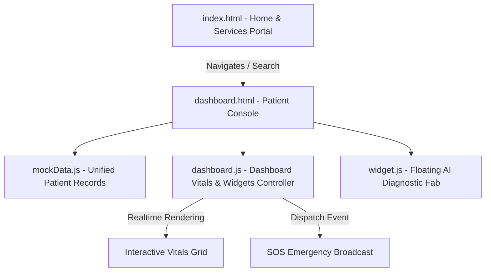

# 🩺 AegisHealth — Futuristic AI-Powered Healthcare Portal

<p align="center">
  
</p>

<p align="center">
  
  
  
  
  
  
</p>

<h3 align="center">
  An interactive, premium, dark-themed virtual clinical workspace and telemetry dashboard designed for next-generation personalized patient care.
</h3>

<p align="center">
  <a href="#-key-features">Key Features</a> •
  <a href="#-interactive-demo-checklist">Interactive Demo Checklist</a> •
  <a href="#-technology-stack">Tech Stack</a> •
  <a href="#-system-architecture">Architecture</a> •
  <a href="#-quick-start">Quick Start</a>
</p>

---

## 🌟 Key Features

| Feature | Description | Interactive Elements |
| :--- | :--- | :--- |
| **📊 Vitals Telemetry** | Real-time tracking of critical patient health metrics. | Heart Rate, Blood Pressure, SpO2, Temperature, Blood Glucose widgets with live pulsing animations. |
| **🚨 Emergency SOS** | Immediate critical care alert system for patient dispatch. | 5-second countdown timer with cancel option, broadcasts vitals, blood type, and GPS coordinates to responders. |
| **🤖 AI Doctor Assistant** | Integrated conversational AI triage and diagnostics helper. | Interactive symptoms input box with custom clinical advice generator. |
| **💧 Hydration Logger** | Daily liquid intake management tracker. | Fluid progress visualizer with `+250ml` and `+500ml` logging controls. |
| **⚖️ AI BMI Calculator** | Instant calculation of body composition metrics. | Fully interactive weight and height input slider with dynamic category styling. |
| **👥 Family Switcher** | Switch views between family members' records. | Preloaded profiles for Shivam (Self), Rajesh (Father), and Priya (Sister). |

---

## ⚡ Interactive Demo Checklist

Here is a quick guide on how to test the application's premium micro-interactions:
*   [ ] **Theme Switcher**: Tap the Moon/Sun icon in the top header. Watch the entire application switch seamlessly between a glowing void-dark portal and a clean high-contrast laboratory light mode.
*   [ ] **SOS Emergency Broadcast**: Go to the Dashboard and click the **SOS** button. The screen will pulse red with emergency indicators. If not canceled within 5 seconds, it locks in, logging coordinates and blood types for paramedics.
*   [ ] **Family Vitals Switcher**: Click the user profile avatar in the navigation bar or use the family switcher dropdown. The dashboard will instantly transition all charts, active prescriptions, and risk trackers to update with that family member's specific medical history.
*   [ ] **Water intake Logger**: Track your water levels. Click `+250ml` or `+500ml` to see the liquid level raise in real time with wave animations.

---

## 🛠️ Technology Stack

AegisHealth is built from the ground up using modern vanilla frameworks to guarantee performance and compatibility:

*   **Logic & Routing**: ES6+ JavaScript modules.
*   **Design Framework**: Tailwind CSS Play CDN for utility styles.
*   **Theme Engine**: CSS Custom Properties for immediate dark/light color palette transition without screen flicker.
*   **Visualizing Telemetry**: GreenSock Animation Platform (GSAP) & Lenis Scroll for natural, momentum-based scrolling transitions.
*   **Telemetry Graphing**: Chart.js for high-fidelity interactive clinical historical logs.

---

## 📊 System Architecture

AegisHealth uses a modular architecture where files have singular responsibilities:



### File Hierarchy
```
aegishealth-futuristic-portal/
├── index.html         # Homepage, services preview, and search portal
├── dashboard.html     # Patient console dashboard (SOS, AI doctor, vitals details)
├── banner.png         # Project banner image
├── css/
│   └── style.css      # Core styles, glassmorphism, keyframes, scrollbars
└── js/
    ├── app.js         # Core homepage logic and interactive widgets
    ├── dashboard.js   # Telemetry, SOS state, vitals renderer, AI Assistant
    ├── mockData.js    # Local datastore for family members, vitals, prescriptions
    └── widget.js      # Embeddable quick-access chat widget
```

---

## 🏁 Quick Start & Running Locally

1.  **Clone the Repository**:
    ```bash
    git clone https://github.com/YashDev12/aegishealth-futuristic-portal.git
    cd aegishealth-futuristic-portal
    ```
2.  **Start a Local Server** (recommended to bypass CORS checks on modern browsers):
    Using Node.js:
    ```bash
    npx serve
    ```
    Or Python:
    ```bash
    python -m http.server 8000
    ```
3.  **Open in Browser**: Open `http://localhost:3000` (or `http://localhost:8000`) in your browser.

---

## 🎨 Premium Design System Details

*   **Color Palette**: Carefully curated void dark (`#040d1e`) background with glowing cobalt blue (`#0F6FFF`) and cyberpunk cyan (`#22D3EE`) accents to give a medical-futuristic aesthetic.
*   **Glassmorphism Panels**: Premium panels built with customized border-radius (`20px`), backdrop-blur (`12px`), and subtle glow highlights (`rgba(255,255,255,0.03)`).
*   **Micro-Animations**: Keyframe animations matching heartbeat telemetry to mimic visual life.
